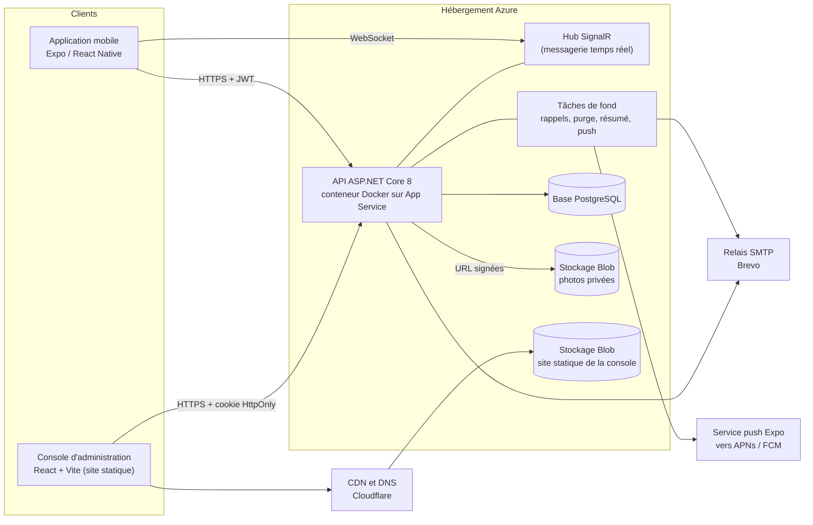
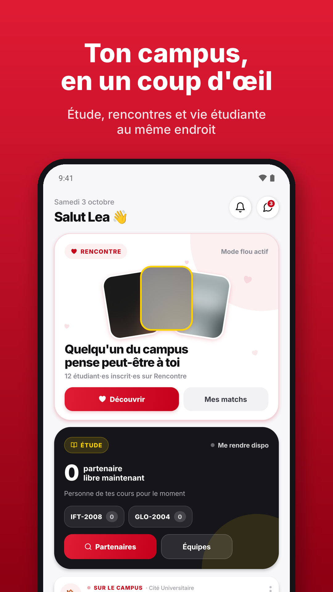
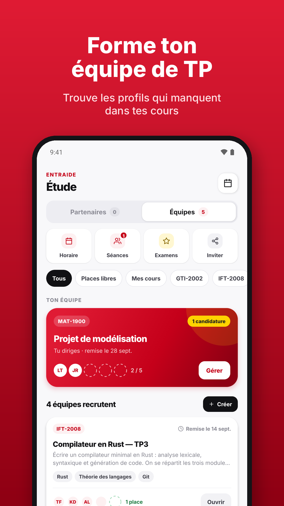
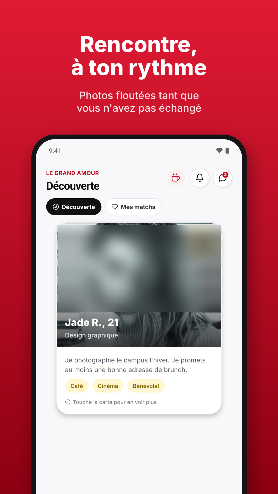
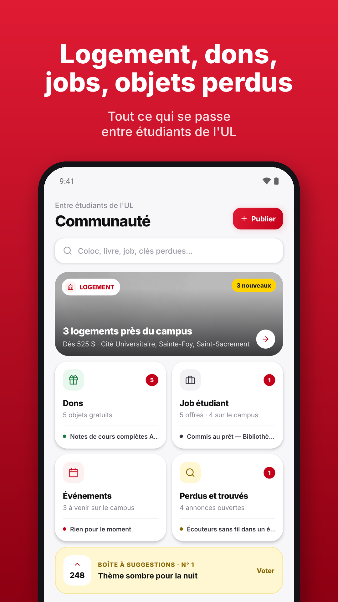
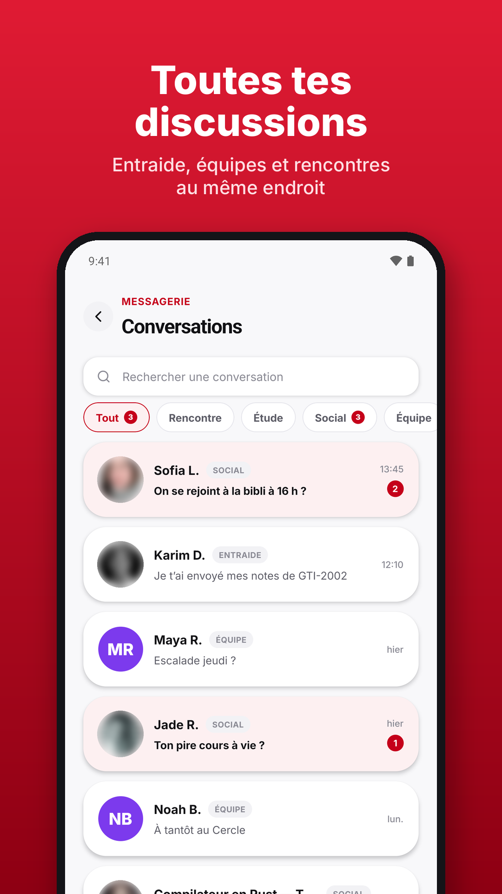
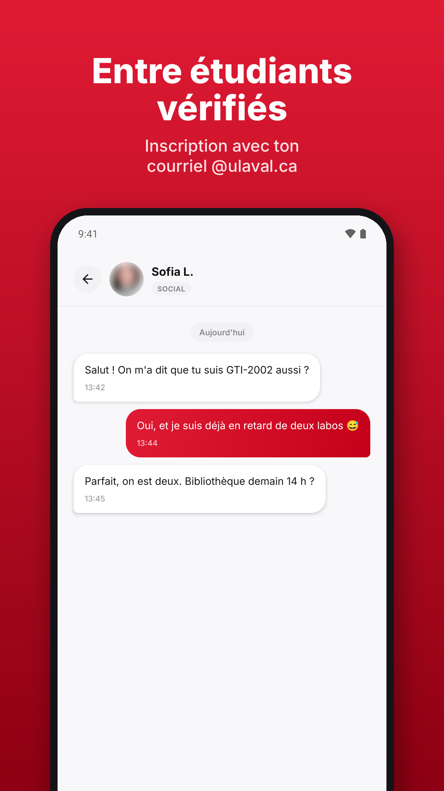

# ULconnect

Plateforme d'entraide, de messagerie et de vie de campus pour les étudiants de l'Université Laval : application mobile, API et console d'administration.

## Statut du projet

- Application Android **en validation sur Google Play** (test fermé). Elle n'est pas disponible au public sur les stores.
- **Aucun utilisateur réel** pour l'instant : les tests ont été faits avec des testeurs et des données de démonstration.
- Les achats intégrés Apple et Google ne sont **pas branchés** ; l'abonnement prévu est désactivé.
- **Le code source est privé.** Ce dépôt présente l'architecture, les choix techniques et la démarche qualité, sans le code du produit.

## Le problème et la solution

Sur un grand campus, il est difficile de trouver quelqu'un avec qui étudier dans un cours précis, de savoir qui est disponible maintenant, ou de suivre les annonces étudiantes (logement, dons, emplois, objets perdus) dispersées sur plusieurs groupes.

ULconnect réunit ces usages dans une seule application réservée aux étudiants vérifiés par leur adresse universitaire. L'horaire de chaque étudiant sert à trouver des partenaires libres dans les mêmes cours, la messagerie fonctionne en temps réel, et toutes les publications passent par une modération. Une console web permet à une petite équipe de modérer, gérer les comptes et publier des événements, avec des rôles distincts.

## Fonctionnalités clés

### Application mobile

- Connexion sans mot de passe par code envoyé à l'adresse universitaire ; verrouillage biométrique facultatif.
- Étude et entraide : partenaires classés par cours en commun et disponibilité, horaire personnel dont les trous deviennent des disponibilités, séances d'étude avec rappels, examens, demandes d'aide urgentes par cours, équipes de travaux pratiques.
- Messagerie à deux et de groupe en temps réel (SignalR) : indicateur de saisie, réactions, réponses, mentions.
- Communauté : logement, dons d'objets, emplois, objets perdus et trouvés, événements, boîte à idées, toutes les publications étant validées avant affichage.
- Mode rencontre séparé, désactivé par défaut, avec photos floutées et sécurité du premier rendez-vous.
- Données personnelles : export complet, suppression du compte.
- Français et anglais, thème clair et sombre.

### API

- 256 routes HTTP dans 50 contrôleurs, un hub SignalR, une sonde de santé.
- Tâches de fond : file de notifications push, rappels, purge des comptes inactifs, résumé hebdomadaire par courriel.
- Pages publiques servies par l'API : politique de confidentialité, conditions d'utilisation, demande de suppression de compte.

### Console d'administration

- 15 pages d'administration et un espace organisateur d'événements (3 pages).
- 6 rôles : super administrateur, modérateur senior, modérateur, registraire, lecture seule, organisateur d'événements.
- File de modération, fiches utilisateurs (avertir, suspendre, bannir, exporter), journal d'audit, paramètres de la plateforme.
- Modèle d'abonnement piloté par un indicateur de configuration : la page existe, l'activation est bloquée tant que les achats ne sont pas branchés.

## Chiffres clés

Relevés dans le code le 6 octobre 2026.

| Mesure | Valeur |
|---|---|
| Routes HTTP de l'API | 256 |
| Contrôleurs | 50 |
| Tables de la base | 58 |
| Migrations Entity Framework Core | 43 |
| Écrans de l'application mobile | 65 |
| Tests automatisés de l'API | 509, tous au vert |
| Tests automatisés de l'application mobile | 58, tous au vert |
| Rôles de la console | 6 |
| Test de charge local | 2 000 inscriptions par minute, 100 % réussies (conditions plus bas) |

## Architecture

- **Application mobile** : une seule base de code TypeScript pour Android et iOS. Elle appelle l'API en HTTPS avec un jeton JWT et garde une connexion SignalR ouverte pour la messagerie.
- **Console d'administration** : application React compilée en fichiers statiques, servie depuis un stockage Blob derrière Cloudflare. Elle s'authentifie par cookie HttpOnly avec protection CSRF.
- **API** : ASP.NET Core 8 en conteneur Docker. Elle porte toute la logique métier, le hub temps réel et les tâches planifiées.
- **Base PostgreSQL** : schéma géré par les migrations Entity Framework Core, appliquées au démarrage.
- **Stockage Blob** : photos dans un conteneur privé, accessibles uniquement par des URL signées et temporaires.
- **Services externes** : relais SMTP pour les codes et le résumé hebdomadaire, service push d'Expo pour les notifications.

Détails : [docs/architecture.md](docs/architecture.md).

## Stack technique

| Couche | Technologie | Rôle |
|---|---|---|
| Mobile | Expo SDK 57, React Native 0.86, React 19.2, TypeScript 6.0 | Application Android et iOS |
| Mobile | React Navigation 7, client SignalR | Navigation, temps réel |
| Mobile | expo-secure-store, expo-local-authentication, expo-notifications | Jetons, biométrie, push |
| API | ASP.NET Core 8 (C#) | API REST et hub SignalR |
| API | Entity Framework Core 8, Npgsql | Accès aux données, migrations |
| API | FluentValidation 11 | Validation des requêtes |
| API | MailKit | Envoi de courriels SMTP |
| API | QuestPDF | Export des données personnelles en PDF |
| API | Polly (Microsoft.Extensions.Http.Resilience) | Nouvelles tentatives des appels sortants |
| Données | PostgreSQL (production), SQLite (local et tests) | Base relationnelle |
| Console | React 19, Vite 8, React Router 7, TanStack Query 5 | Interface d'administration |
| Tests | xUnit, WebApplicationFactory, Jest, React Native Testing Library | Tests d'intégration et de composants |

## Infrastructure et DevOps

- **Docker** : image multi-étapes de l'API, exécutée sans root ; Docker Compose pour lancer l'API, PostgreSQL et la console en local.
- **Azure** : App Service (conteneur Linux) pour l'API, PostgreSQL géré, Blob Storage pour les photos et pour le site statique de la console.
- **Cloudflare** : DNS et certificat TLS devant le site statique.
- **Courriel** : relais SMTP Brevo, domaine d'envoi authentifié par SPF, DKIM et DMARC.
- **GitHub Actions** : CI sur chaque pull request (tests de l'API, vérification TypeScript du mobile, compilation de la console) ; déploiement continu à chaque fusion, avec les tests en barrière, une image étiquetée par commit et un seul déploiement à la fois.
- **EAS Build** : construction des APK de test et des AAB pour Google Play.

Détails : [docs/tests-et-ci-cd.md](docs/tests-et-ci-cd.md).

## Sécurité et conformité (Loi 25)

- Code de connexion haché, annulé après 5 essais ; JWT court et jeton de renouvellement avec rotation et détection de rejeu.
- Console : mot de passe PBKDF2, double authentification TOTP obligatoire, cookie HttpOnly et anti-CSRF, permissions par rôle.
- Limitation de débit globale et par route sensible, adaptée aux réseaux partagés du campus.
- En-têtes de sécurité (HSTS, CSP, X-Frame-Options), CORS par liste d'origines.
- Métadonnées GPS retirées des photos, URL signées, courriels masqués dans les journaux, notifications neutres sur l'écran verrouillé.
- Loi 25 : consentement versionné au premier lancement, export et suppression des données depuis l'application, purge des comptes inactifs après 24 mois, registre des incidents, mode rencontre désactivé par défaut.
- Deux audits internes ; les constats critiques et de gravité haute sont corrigés. Pas encore d'audit externe ni de relecture juridique.

Détails : [docs/securite-et-loi-25.md](docs/securite-et-loi-25.md).

## Qualité

- **509 tests d'intégration** sur l'API : l'application complète démarre en mémoire avec une base SQLite par classe de test ; seules les dépendances externes sont simulées.
- **58 tests** sur l'application mobile (écrans, composants, services).
- **Test de charge « pic de rentrée »**, réalisé en local sur un Mac de développement (8 coeurs) avec PostgreSQL 16 dans Docker, 100 000 comptes et 4 millions de messages générés. Scénario : N nouveaux étudiants s'inscrivent et ouvrent l'application en une minute.
  - Avant optimisation, à 2 000 inscriptions par minute : 31 % des profils non enregistrés, réponses de 30 secondes.
  - Après optimisation : 100 % réussies, 95 % des requêtes en 2,1 s ou moins.
  - Ces chiffres mesurent l'effet des optimisations sur une machine locale, pas la capacité garantie en production.

## Décisions techniques marquantes

1. **Connexion sans mot de passe** pour les étudiants et modèle d'authentification séparé pour la console.
2. **SQLite en local et en tests, PostgreSQL en production**, avec le même modèle de données.
3. **Console en site statique** sur stockage Blob plutôt que dans un conteneur, pour réduire les coûts.
4. **Cache partagé de 30 secondes** sur les lectures communes, issu directement du test de charge.
5. **Déploiement ordonné** : image étiquetée par commit, tests en barrière, un déploiement à la fois.

Contexte, options et compromis : [docs/decisions-techniques.md](docs/decisions-techniques.md).

## Ce que j'ai appris et ce qui reste à faire

**Appris**

- Mesurer avant d'optimiser : le test de charge a montré que le goulot était quelques requêtes identiques pour tous les utilisateurs, pas le code applicatif.
- Une limite de débit par IP derrière un proxy mal configuré devient une limite globale ; une limite par IP pénalise aussi les réseaux partagés.
- Des tests d'intégration qui passent par le vrai pipeline HTTP trouvent des erreurs d'autorisation qu'aucun test unitaire n'aurait vues.
- La conformité (consentement, export, suppression, conservation) se conçoit dans le modèle de données, pas à la fin.

**Limites actuelles et prochaines étapes**

- Validation Google Play en cours ; version iOS pas encore soumise.
- Pas d'utilisateurs réels : le comportement en production à grande échelle n'est pas observé.
- Achats intégrés Apple et Google non branchés.
- Une seule instance de l'API, par choix de simplicité : tâches de fond et cache en mémoire à adapter avant de passer à plusieurs instances.
- Tests mobiles pas encore exécutés dans la CI.
- Relecture juridique des textes et audit de sécurité externe à faire.

Feuille de route complète : [docs/feuille-de-route.md](docs/feuille-de-route.md).

## Captures d'écran

Visuels préparés pour la fiche Google Play. Toutes les données affichées (noms, messages, annonces, compteurs) sont des données de démonstration : l'application n'a pas encore d'utilisateurs réels.

| | | |
|---|---|---|
|  |  |  |
|  |  |  |

## Contact

**Moïse Innocent Agbossaga**, développeur logiciel, étudiant au DESS en intelligence artificielle à l'Université Laval. Québec.

- LinkedIn : linkedin.com/in/moise-agbossaga
- GitHub : github.com/moseswisegit
- Courriel : moseswisegit@gmail.com

Le code source est privé. Accès en lecture possible sur demande ou démonstration en partage d'écran.
